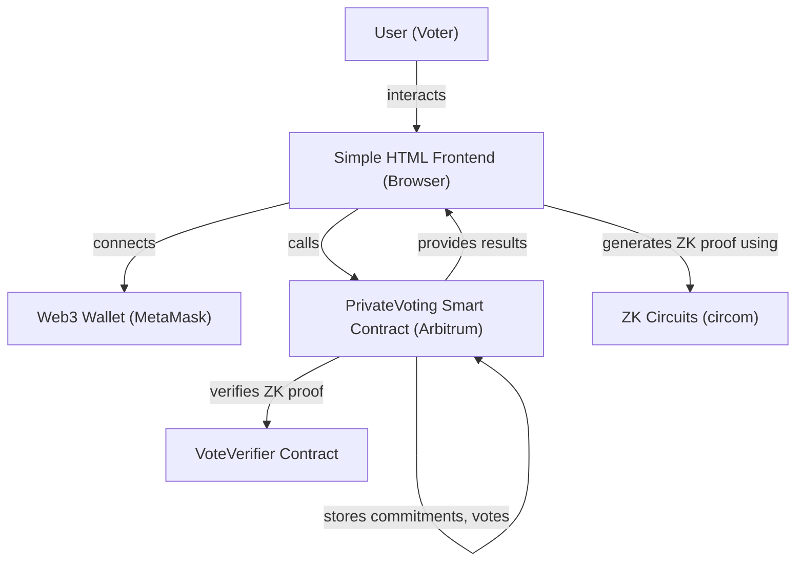

# 🗳️ Private Voting DApp

A decentralized voting application with zero-knowledge privacy built on Arbitrum.

## Features

- **Private Voting**: Uses zero-knowledge proofs to ensure vote privacy
- **Wallet Integration**: Connect with MetaMask or other Web3 wallets
- **On-Chain Candidates**: Candidate management is handled directly in the smart contract.
- **Anti-Double Voting**: Cryptographic nullifiers prevent multiple votes
- **Real-time Results**: Live vote tallying with privacy preservation

## Architecture

```
├── circuits/          # Circom ZK circuits and artifacts for vote privacy
├── contracts/         # Solidity smart contracts, deployment scripts, and tests
├── frontend/          # A simple HTML frontend for interacting with the contract
```

### System Architecture Diagram



## Privacy Model

1. **Registration Phase**: Users register with a commitment hash
2. **Voting Phase**: ZK proofs prove eligibility without revealing identity
3. **Tallying**: Only vote counts are public, not individual choices

## Quick Start

### 1. Install Dependencies

```bash
# Install circuit dependencies
cd circuits && npm install

# Install contract dependencies  
cd ../contracts && npm install
```

### 2. Setup ZK Circuits

This step is only necessary if you want to re-generate the circuit artifacts. The necessary files (`vote.wasm`, `vote_0001.zkey`, and `VoteVerifier.sol`) are already included in the repository.

```bash
cd circuits
# This script will compile the circuit and generate the proving and verification keys.
# It will also generate the VoteVerifier.sol contract.
./setup.sh 
```

### 3. Configure Environment

Create a `.env` file in the root of the project and add the following:

```
ARBITRUM_RPC_URL="YOUR_ARBITRUM_RPC_URL"
PRIVATE_KEY="YOUR_PRIVATE_KEY"
```

### 4. Deploy Contracts

```bash
cd contracts
npm run deploy
```

This will deploy the `PrivateVoting` and `VoteVerifier` contracts to the Arbitrum network. The deployment script will also add four candidates and set the voting periods.

### 5. Configure and Run the Frontend

1.  After deploying the contracts, the `contracts` directory will contain a `deployment.json` file. Copy the address of the `voting` contract from this file.
2.  Open the `frontend/simple-frontend.html` file and replace the placeholder `CONTRACT_ADDRESS` with the address you copied.
3.  Copy the `vote.wasm` and `vote_0001.zkey` files from the `circuits` directory to the `frontend` directory.
4.  Serve the `frontend` directory with a simple web server:

```bash
cd frontend
python3 -m http.server 3050
```

## Usage

1.  Open `http://localhost:3050/simple-frontend.html` in a browser with MetaMask installed.
2.  **Connect Wallet**: Click "Connect Wallet" to connect MetaMask to the Arbitrum network.
3.  **Register**: If the registration period is active, you'll see a "Register to Vote" button. Click it to generate a secret and register your commitment on the blockchain.
4.  **Vote**: If the voting period is active, you'll be able to select a candidate and cast your vote. This will generate a ZK proof in your browser.
5.  **Results**: After the voting period ends, the results will be displayed.

## Development

### Running Tests

```bash
cd contracts
npm test
```

This will run the test suite, which includes tests for ZKP generation and verification.

## License

MIT License - see LICENSE file for details.

## Disclaimer

This is a demonstration application. Conduct thorough security audits before production use.
