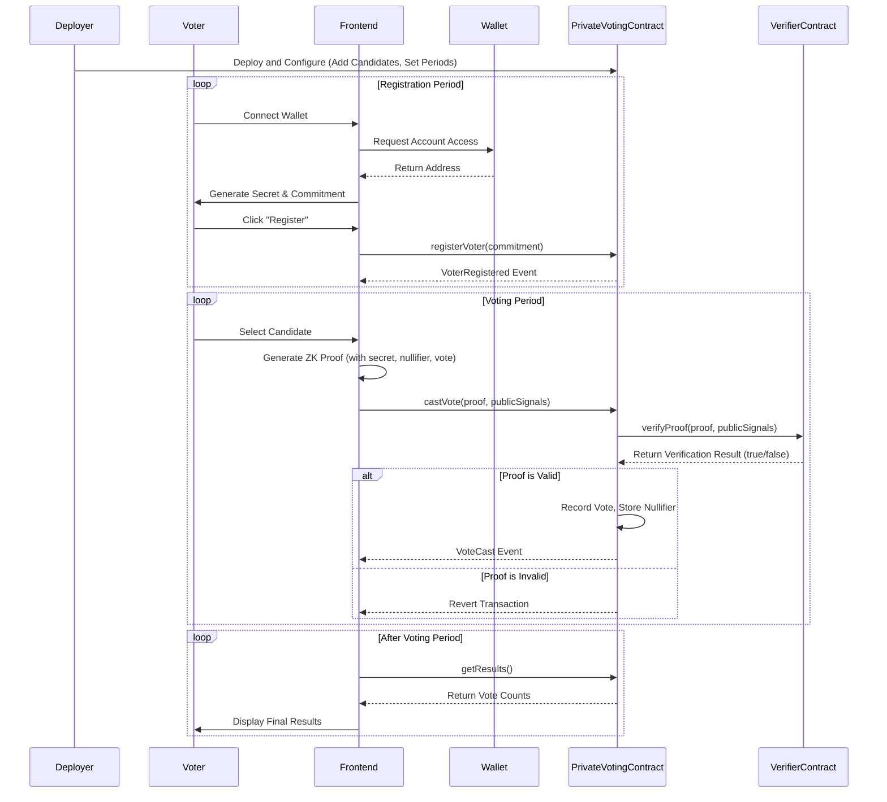

# 🗳️ Private Voting DApp

A decentralized voting application with zero-knowledge privacy built on Arbitrum.

## How It Works

This system enables private and secure voting using a combination of smart contracts and zero-knowledge proofs (ZKPs). The process is divided into distinct phases to ensure that no one can link a voter's identity to their vote.

1.  **Setup (Tau Ceremony)**: Before any voting can happen, a trusted setup ceremony (often called a Powers of Tau ceremony) must be performed for the ZK-SNARK circuit. This is a critical security step. Multiple participants contribute randomness to generate a set of public parameters. The security of the entire system relies on at least one participant in this ceremony being honest and discarding their random input (the "toxic waste"). The more participants, the stronger the security guarantee.

2.  **Deployment**: The contract deployer is responsible for setting up the election. This involves:
    *   Deploying the `VoteVerifier.sol` contract, which is generated during the circuit setup.
    *   Deploying the main `PrivateVoting.sol` contract, linking it to the verifier.
    *   Adding the official candidates for the election.
    *   Setting the start and end times for both the registration and voting periods.

3.  **Registration**: Voters connect their wallets and register to vote. During registration, the frontend generates a unique, secret value for the voter. It then calculates a "commitment" from this secret and sends it to the smart contract. The contract stores this commitment, marking the voter as eligible without knowing their secret.

4.  **Voting**: When a voter casts their ballot, the following happens in their browser:
    *   A ZK proof is generated. This proof mathematically confirms two things:
        1.  The voter knows the secret corresponding to a registered commitment.
        2.  The voter has not voted before (enforced by a "nullifier").
    *   The proof is sent to the `PrivateVoting` smart contract along with the chosen candidate ID.
    *   The contract uses the `VoteVerifier` to validate the ZK proof. If the proof is valid, the vote is counted.

Because the ZK proof is not linked to the voter's original commitment, the vote remains anonymous.

## Sequence Diagram



## Deployer Steps

As the contract deployer, you are responsible for setting up the election securely.

1.  **Circuit Setup (Powers of Tau)**:
    *   Navigate to the `circuits` directory.
    *   Run the `./setup.sh` script. This script compiles the Circom circuit and performs a basic setup ceremony.
    *   **Security Warning**: For a real election, you must perform a multi-participant Powers of Tau ceremony. The included `setup.sh` is for demonstration purposes only.

2.  **Configure Environment**:
    *   Create a `.env` file in the project root.
    *   Add your `ARBITRUM_RPC_URL` and the `PRIVATE_KEY` of the deployer account.

3.  **Configure Candidates**:
    *   Edit the `contracts/candidates.json` file. This file contains the list of candidates that will be added to the contract upon deployment.

4.  **Deploy Contracts**:
    *   Navigate to the `contracts` directory.
    *   Run `npm run deploy`. This will:
        *   Deploy the `VoteVerifier.sol` contract.
        *   Deploy the `PrivateVoting.sol` contract.
        *   Read the `candidates.json` file and add each candidate to the contract.
        *   Set the registration and voting periods as defined in the deployment script.

5.  **Update Frontend**:
    *   After deployment, a `deployment.json` file is created in the `contracts` directory. Copy the `voting` contract address from this file.
    *   Paste this address into the `CONTRACT_ADDRESS` constant in `frontend/simple-frontend.html`.
    *   Copy the `vote.wasm` and `vote_0001.zkey` files from `circuits/` to `frontend/`.

## Quick Start

### 1. Install Dependencies

```bash
# Install circuit dependencies
cd circuits && npm install

# Install contract dependencies  
cd ../contracts && npm install
```

### 2. Setup ZK Circuits

This step is only necessary if you want to re-generate the circuit artifacts. The necessary files (`vote.wasm`, `vote_0001.zkey`, and `VoteVerifier.sol`) are already included in the repository.

```bash
cd circuits
# This script will compile the circuit and generate the proving and verification keys.
# It will also generate the VoteVerifier.sol contract.
./setup.sh 
```

### 3. Configure and Run the Frontend

1.  Serve the `frontend` directory with a simple web server:

```bash
cd frontend
python3 -m http.server 3050
```

## Usage

1.  Open `http://localhost:3050/simple-frontend.html` in a browser with MetaMask installed.
2.  **Connect Wallet**: Click "Connect Wallet" to connect MetaMask to the Arbitrum network.
3.  **Register**: If the registration period is active, you'll see a "Register to Vote" button. Click it to generate a secret and register your commitment on the blockchain.
4.  **Vote**: If the voting period is active, you'll be able to select a candidate and cast your vote. This will generate a ZK proof in your browser.
5.  **Results**: After the voting period ends, the results will be displayed.

## Development

### Running Tests

```bash
cd contracts
npm test
```

This will run the test suite, which includes tests for ZKP generation and verification.

## License

MIT License - see LICENSE file for details.

## Disclaimer

This is a demonstration application. Conduct thorough security audits before production use.
